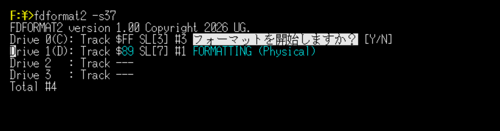

# FDFORMAT2

[English](README.md) | [日本語](README.ja.md)

FDFORMAT2 is a 2HD floppy disk formatter for the X68000.\
It performs both physical and logical formatting on an inserted disk.\
Physical-only and logical-only formatting can also be selected.

---

## Features

* Supports up to 4 floppy disk drives\
  (2 built-in drives + up to 2 external drives)

* Automatically detects inserted disks

* Confirms before formatting starts (`Y` → `ENTER`)

* Automatically ejects the disk after formatting is complete

* Formats multiple drives in parallel

* Displays the number of disks formatted, per drive and in total

* Supports sector slide (a different slide value can be given per drive)

* A mode without user confirmation (**FORCE MODE**) can also be selected

---

## Usage

```
usage: fdformat2 [switch]
switch:  -p            physical format only
         -l            logical format only
         -s<0-7>...    sector slide value (default:2)
         -force        force mode (skip confirmation)
```

1. Run `FDFORMAT2`
2. Insert floppy disks into available drives
3. Answer the confirmation with `Y` → `ENTER`
4. When formatting is complete, the disk is ejected automatically
5. Insert the next disk and continue

Waiting for a confirmation does not stop formatting already in progress on other drives.

See the included manual for details.



---

## Exit

Exiting begins with `ESC`.

| Key | Action |
|---|---|
| `ESC` | Stop accepting new disks, and exit after formatting in progress is complete |
| `ESC` → `Q` | Abort formatting in progress and exit (with confirmation) |

In **FORCE MODE**, the `ESC` → `Q` confirmation is not performed.

---

## Sector Slide

Sector slide shifts the sector start position while formatting,\
mainly to speed up disk access over contiguous areas.

The default value is 2. It can be changed with `-s`.

```
fdformat2 -s3       set 3 for all drives
fdformat2 -s0123    set drives 0, 1, 2 and 3 in order
```

`-s0` formats without slide.

---

## Formatted Disk

Disks are formatted as 2HD (1024 bytes x 8 sectors x 77 cylinders x 2 sides).

Logical formatting writes the BPB, FAT, root directory, and a minimal IPL.

A volume serial number is recorded. The generation rule is shared with moformat.

Formatted disks can also be read and written by MS-DOS on PC-98 series 2HD (1.2MB FDD) systems.

---

## Technical Notes

The program uses Human68k DOS / IOCS calls to:

* detect drive media state
* perform physical formatting
* write the logical format
* control disk ejection
* update progress display

Each drive holds its own state, polled and processed in parallel from the main loop.

---

## Notes

* Intended for X68000 systems with floppy disk drives
* Behavior may depend on drive configuration

---

## License

MIT License
